| ID | Effect | Flags | Master | Branch | New
| ---: | --- | --- | --- | --- | ----
| 0 | Solid | ⋮ |  |  | 
| 1 | Blink | ⋮ |  | 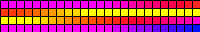 | 
| 2 | Breathe | ⋮ |  | 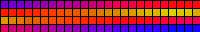 | 
| 3 | Wipe | ⋮ |  |  | 
| 4 | Wipe Random | ⋮ |  |  | 
| 5 | Random Colors | ⋮ |  | 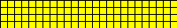 | 
| 6 | Sweep | ⋮ |  | 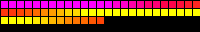 | 
| 7 | Dynamic | ⋮ |  | 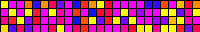 | 
| 8 | Colorloop | ⋮ |  |  | 
| 9 | Rainbow | ⋮ |  |  | 
| 10 | Scan | ⋮ |  |  | 
| 11 | Scan Dual | ⋮ |  | 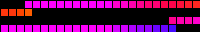 | 
| 12 | Fade | ⋮ |  | 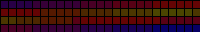 | 
| 13 | Theater | ⋮ |  |  | 
| 14 | Theater Rainbow | ⋮ |  |  | 
| 15 | Running | ⋮ |  |  | 
| 16 | Saw | ⋮ |  |  | 
| 17 | Twinkle | ⋮ |  |  | 
| 18 | Dissolve | ⋮ |  |  | 
| 19 | Dissolve Rnd | ⋮ |  |  | 
| 20 | Sparkle | ⋮ |  | 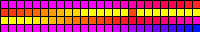 | 
| 21 | Sparkle Dark | ⋮ |  |  | 
| 22 | Sparkle+ | ⋮ |  |  | 
| 23 | Strobe | ⋮ |  |  | 
| 24 | Strobe Rainbow | ⋮ |  |  | 
| 25 | Strobe Mega | ⋮ |  |  | 
| 26 | Blink Rainbow | ⋮ |  | 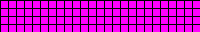 | 
| 27 | Android | ⋮ |  |  | 
| 28 | Chase | ⋮ |  |  | 
| 29 | Chase Random | ⋮ |  | 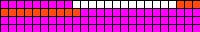 | 
| 30 | Chase Rainbow | ⋮ |  |  | 
| 31 | Chase Flash | ⋮ |  |  | 
| 32 | Chase Flash Rnd | ⋮ |  |  | 
| 33 | Rainbow Runner | ⋮ |  |  | 
| 34 | Colorful | ⋮ |  |  | 
| 35 | Traffic Light | ⋮ |  |  | 
| 36 | Sweep Random | ⋮ |  |  | 
| 37 | Chase 2 | ⋮ |  |  | 
| 38 | Aurora | ⋮ |  |  | 
| 39 | Stream | ⋮ |  |  | 
| 40 | Scanner | ⋮ |  |  | 
| 41 | Lighthouse | ⋮ |  | 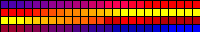 | 
| 42 | Fireworks | ⋮ ▦ |  |  | 
| 43 | Rain | ⋮ ▦ |  |  | 
| 44 | Tetrix | ⋮ |  | 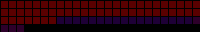 | 
| 45 | Fire Flicker | ⋮ |  |  | 
| 46 | Gradient | ⋮ |  |  | 
| 47 | Loading | ⋮ |  | 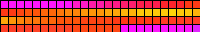 | 
| 49 | Fairy | ⋮ |  | 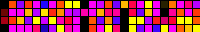 | 
| 50 | Two Dots | ⋮ |  |  | 
| 51 | Fairytwinkle | ⋮ |  | 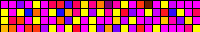 | 
| 52 | Running Dual | ⋮ |  |  | 
| 54 | Chase 3 | ⋮ |  |  | 
| 55 | Tri Wipe | ⋮ |  |  | 
| 56 | Tri Fade | ⋮ |  |  | 
| 57 | Lightning | ⋮ |  |  | 
| 58 | ICU | ⋮ |  |  | 
| 59 | Multi Comet | ⋮ |  | 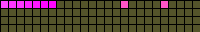 | 
| 60 | Scanner Dual | ⋮ |  |  | 
| 61 | Stream 2 | ⋮ |  |  | 
| 62 | Oscillate | ⋮ |  |  | 
| 63 | Pride 2015 | ⋮ |  |  | 
| 64 | Juggle | ⋮ |  |  | 
| 65 | Palette | ⋮ |  |  | 
| 66 | Fire 2012 | ⋮ |  |  | 
| 67 | Colorwaves | ⋮ |  | 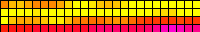 | 
| 68 | Bpm | ⋮ |  |  | 
| 69 | Fill Noise | ⋮ |  |  | 
| 70 | Noise 1 | ⋮ |  | 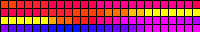 | 
| 71 | Noise 2 | ⋮ |  |  | 
| 72 | Noise 3 | ⋮ |  |  | 
| 73 | Noise 4 | ⋮ |  |  | 
| 74 | Colortwinkles | ⋮ |  |  | 
| 75 | Lake | ⋮ |  |  | 
| 76 | Meteor | ⋮ |  | 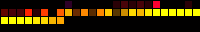 | 
| 77 | Meteor Smooth | ⋮ |  |  | 
| 78 | Railway | ⋮ |  |  | 
| 79 | Ripple | ⋮ ▦ |  |  | 
| 80 | Twinklefox | ⋮ |  | 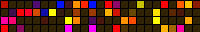 | 
| 81 | Twinklecat | ⋮ |  |  | 
| 82 | Halloween Eyes | ⋮ ▦ |  |  | 
| 83 | Solid Pattern | ⋮ |  |  | 
| 84 | Solid Pattern Tri | ⋮ |  |  | 
| 85 | Spots | ⋮ |  |  | 
| 86 | Spots Fade | ⋮ |  |  | 
| 87 | Glitter | ⋮ |  |  | 
| 88 | Candle | ⋮ |  |  | 
| 89 | Fireworks Starburst | ⋮ |  |  | 
| 90 | Fireworks 1D | ⋮ ▦ |  |  | 
| 91 | Bouncing Balls | ⋮ |  |  | 
| 92 | Sinelon | ⋮ |  | 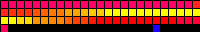 | 
| 93 | Sinelon Dual | ⋮ |  |  | 
| 94 | Sinelon Rainbow | ⋮ |  |  | 
| 95 | Popcorn | ⋮ |  |  | 
| 96 | Drip | ⋮ |  |  | 
| 97 | Plasma | ⋮ |  | 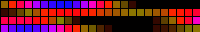 | 
| 98 | Percent | ⋮ |  | 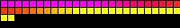 | 
| 99 | Ripple Rainbow | ⋮ ▦ |  |  | 
| 100 | Heartbeat | ⋮ |  |  | 
| 101 | Pacifica | ⋮ |  | 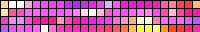 | 
| 102 | Candle Multi | ⋮ |  |  | 
| 103 | Solid Glitter | ⋮ |  |  | 
| 104 | Sunrise | ⋮ |  | 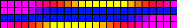 | 
| 105 | Phased | ⋮ |  |  | 
| 106 | Twinkleup | ⋮ |  |  | 
| 107 | Noise Pal | ⋮ |  |  | 
| 108 | Sine | ⋮ |  | 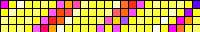 | 
| 109 | Phased Noise | ⋮ |  |  | 
| 110 | Flow | ⋮ |  | 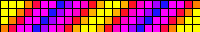 | 
| 111 | Chunchun | ⋮ |  |  | 
| 112 | Dancing Shadows | ⋮ |  | 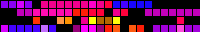 | 
| 113 | Washing Machine | ⋮ |  |  | 
| 115 | Blends | ⋮ |  |  | 
| 116 | TV Simulator | ⋮ |  |  | 
| 117 | Dynamic Smooth | ⋮ |  |  | 
| 118 | Spaceships | ▦ |  |  | 
| 119 | Crazy Bees | ▦ |  |  | 
| 120 | Ghost Rider | ▦ |  |  | 
| 121 | Blobs | ▦ |  | 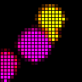 | 
| 122 | Scrolling Text | ▦ |  | 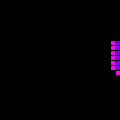 | 
| 123 | Drift Rose | ▦ |  | 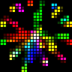 | 
| 124 | Distortion Waves | ▦ |  |  | 
| 128 | Pixels | ⋮ ♪ |  |  | 
| 129 | Pixelwave | ⋮ ♪ |  |  | 
| 130 | Juggles | ⋮ ♪ |  |  | 
| 131 | Matripix | ⋮ ♪ |  |  | 
| 132 | Gravimeter | ⋮ ♪ |  |  | 
| 133 | Plasmoid | ⋮ ♪ |  | 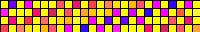 | 
| 134 | Puddles | ⋮ ♪ |  | 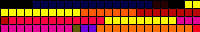 | 
| 135 | Midnoise | ⋮ ♪ |  |  | 
| 136 | Noisemeter | ⋮ ♪ |  |  | 
| 137 | Freqwave | ⋮ ♫ |  | 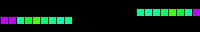 | 
| 138 | Freqmatrix | ⋮ ♫ |  |  | 
| 139 | GEQ | ▦ ♫ |  |  | 
| 140 | Waterfall | ⋮ ♫ |  |  | 
| 141 | Freqpixels | ⋮ ♫ |  | 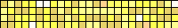 | 
| 143 | Noisefire | ⋮ ♪ |  |  | 
| 144 | Puddlepeak | ⋮ ♪ |  |  | 
| 145 | Noisemove | ⋮ ♫ |  |  | 
| 146 | Noise2D | ▦ |  |  | 
| 147 | Perlin Move | ⋮ |  |  | 
| 148 | Ripple Peak | ⋮ ♪ |  |  | 
| 149 | Firenoise | ▦ |  |  | 
| 150 | Squared Swirl | ▦ |  | 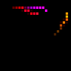 | 
| 152 | DNA | ▦ |  |  | 
| 153 | Matrix | ▦ |  |  | 
| 154 | Metaballs | ▦ |  | 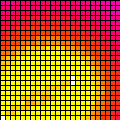 | 
| 155 | Freqmap | ⋮ ♫ |  |  | 
| 156 | Gravcenter | ⋮ ♪ |  |  | 
| 157 | Gravcentric | ⋮ ♪ |  |  | 
| 158 | Gravfreq | ⋮ ♫ |  |  | 
| 159 | DJ Light | ⋮ ♫ |  |  | 
| 160 | Funky Plank | ▦ ♫ |  | 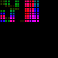 | 
| 162 | Pulser | ▦ |  |  | 
| 163 | Blurz | ⋮ ♫ |  | 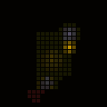 | 
| 164 | Drift | ▦ |  |  | 
| 165 | Waverly | ▦ ♪ |  | 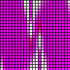 | 
| 166 | Sun Radiation | ▦ |  |  | 
| 167 | Colored Bursts | ▦ |  |  | 
| 168 | Julia | ▦ |  | 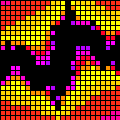 | 
| 172 | Game Of Life | ▦ |  | 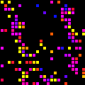 | 
| 173 | Tartan | ▦ |  |  | 
| 174 | Polar Lights | ▦ |  | 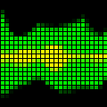 | 
| 175 | Swirl | ▦ ♪ |  |  | 
| 176 | Lissajous | ▦ |  |  | 
| 177 | Frizzles | ▦ |  | 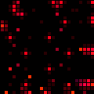 | 
| 178 | Plasma Ball | ▦ |  |  | 
| 179 | Flow Stripe | ⋮ |  |  | 
| 180 | Hiphotic | ▦ |  |  | 
| 181 | Sindots | ▦ |  |  | 
| 182 | DNA Spiral | ▦ |  |  | 
| 183 | Black Hole | ▦ |  | 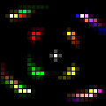 | 
| 184 | Wavesins | ⋮ |  | 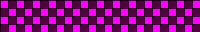 | 
| 185 | Rocktaves | ⋮ ♫ |  | 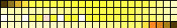 | 
| 186 | Akemi | ▦ ♫ |  |  | 
