### Effects
To aid in showing where colors vs palettes are used, all effects are rendered with the _Party_ palette  
and these colors: primary FF6E41, secondary FFE369,  and tertiary FFB9B8
| ID | Effect | New Vis | Old Vis 
| ---: | --- | --- | ---
| 0 | Solid | 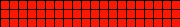 | 
| 1 | Blink |  | 
| 2 | Breathe |  | 
| 3 | Wipe |  | 
| 4 | Wipe Random |  | 
| 5 | Random Colors |  | 
| 6 | Sweep |  | 
| 7 | Dynamic |  | 
| 8 | Colorloop |  | 
| 9 | Rainbow |  | 
| 10 | Scan |  | 
| 11 | Scan Dual |  | 
| 12 | Fade |  | 
| 13 | Theater |  | 
| 14 | Theater Rainbow |  | 
| 15 | Running | 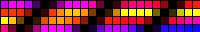 | 
| 16 | Saw | 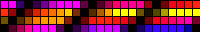 | 
| 17 | Twinkle |  | 
| 18 | Dissolve |  | 
| 19 | Dissolve Rnd |  | 
| 20 | Sparkle |  | 
| 21 | Sparkle Dark |  | 
| 22 | Sparkle+ |  | 
| 23 | Strobe |  | 
| 24 | Strobe Rainbow |  | 
| 25 | Strobe Mega |  | 
| 26 | Blink Rainbow |  | 
| 27 | Android |  | 
| 28 | Chase |  | 
| 29 | Chase Random |  | 
| 30 | Chase Rainbow |  | 
| 31 | Chase Flash |  | 
| 32 | Chase Flash Rnd |  | 
| 33 | Rainbow Runner | 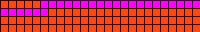 | 
| 34 | Colorful |  | 
| 35 | Traffic Light | 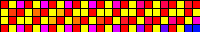 | 
| 36 | Sweep Random |  | 
| 37 | Running 2 | 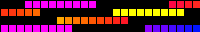 | 
| 38 | Aurora |  | 
| 39 | Stream | 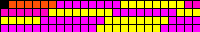 | 
| 40 | Scanner | 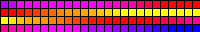 | 
| 41 | Lighthouse |  | 
| 42 | Fireworks | 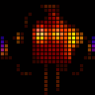 | 
| 43 | Rain | 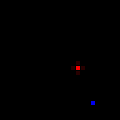 | 
| 44 | Tetrix |  | 
| 45 | Fire Flicker | 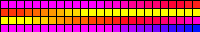 | 
| 46 | Gradient | 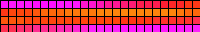 | 
| 47 | Loading |  | 
| 48 | Police |  | 
| 49 | Police All |  | 
| 50 | Two Dots | 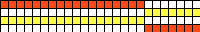 | 
| 51 | Two Areas |  | 
| 52 | Running Dual | 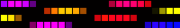 | 
| 53 | Halloween |  | 
| 54 | Tri Chase | 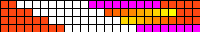 | 
| 55 | Tri Wipe |  | 
| 56 | Tri Fade |  | 
| 57 | Lightning |  | 
| 58 | ICU | 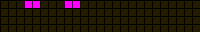 | 
| 59 | Multi Comet |  | 
| 60 | Scanner Dual | 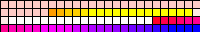 | 
| 61 | Stream 2 |  | 
| 62 | Oscillate |  | 
| 63 | Pride 2015 | 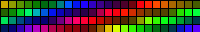 | 
| 64 | Juggle |  | 
| 65 | Palette |  | 
| 66 | Fire 2012 |  | 
| 67 | Colorwaves |  | 
| 68 | Bpm |  | 
| 69 | Fill Noise |  | 
| 70 | Noise 1 |  | 
| 71 | Noise 2 | 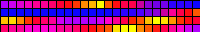 | 
| 72 | Noise 3 |  | 
| 73 | Noise 4 | 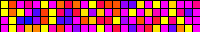 | 
| 74 | Colortwinkles |  | 
| 75 | Lake |  | 
| 76 | Meteor |  | 
| 77 | Meteor Smooth |  | 
| 78 | Railway |  | 
| 79 | Ripple |  | 
| 80 | Twinklefox |  | 
| 81 | Twinklecat | 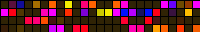 | 
| 82 | Halloween Eyes |  | 
| 83 | Solid Pattern |  | 
| 84 | Solid Pattern Tri |  | 
| 85 | Spots |  | 
| 86 | Spots Fade |  | 
| 87 | Glitter |  | 
| 88 | Candle |  | 
| 89 | Fireworks Starburst |  | 
| 90 | Fireworks 1D |  | 
| 91 | Bouncing Balls |  | 
| 92 | Sinelon |  | 
| 93 | Sinelon Dual |  | 
| 94 | Sinelon Rainbow | 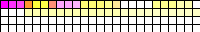 | 
| 95 | Popcorn |  | 
| 96 | Drip |  | 
| 97 | Plasma |  | 
| 98 | Percent |  | 
| 99 | Ripple Rainbow |  | 
| 100 | Heartbeat |  | 
| 101 | Pacifica |  | 
| 102 | Candle Multi |  | 
| 103 | Solid Glitter |  | 
| 104 | Sunrise |  | 
| 105 | Phased |  | 
| 106 | Twinkleup |  | 
| 107 | Noise Pal | 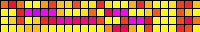 | 
| 108 | Sine |  | 
| 109 | Phased Noise |  | 
| 110 | Flow |  | 
| 111 | Chunchun |  | 
| 112 | Dancing Shadows |  | 
| 113 | Washing Machine |  | 
| 114 | Candy Cane |  | 
| 115 | Blends | 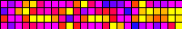 | 
| 116 | TV Simulator |  | 
| 117 | Dynamic Smooth | 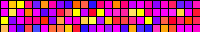 | 
