### SR Effects
All effects are rendered with the Party palette and, of course, _Thunderstruck_ 
#### Volume Reactive Effects
| ID | Effect | Visual | Settings 
| ---: | --- | --- | --- 
| 128 |  ♪ Pixels | 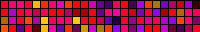 | **Speed**: Fade rate  **Intensity**: # of pixels   
| 129 |  ♪ Pixelwave |  | **Speed**   **Intensity**: Sensitivity   
| 130 |  ♪ Juggles |  | **Speed**   **Intensity**: # of balls   
| 131 |  ♪ Matripix |  | **Speed**   **Intensity**: Brightness   
| 132 |  ♪ Gravimeter |  | **Speed**: Rate of fall  **Intensity**: Sensitivity   
| 133 |  ♪ Plasmoid |  | **Intensity**: # of pixels   
| 134 |  ♪ Puddles |  | **Speed**: Fade rate  **Intensity**: Puddle size   
| 135 |  ♪ Midnoise |  | **Speed**: Fade rate  **Intensity**: Maximum length   
| 136 |  ♪ Noisemeter |  | **Speed**: Fade rate  **Intensity**: Width   
| 143 |  ♪ Noisefire |  | **Speed**   **Intensity**    
| 144 |  ♪ Puddlepeak |  | **Speed**: Fade rate  **Intensity**: Puddle size  **FFT High**: Select bin  **FFT Custom**: Volume (minimum)   
| 148 |  ♪ Ripple Peak | 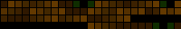 | **Speed**: Fade rate  **Intensity**: Max # of ripples  **FFT High**: Select bin  **FFT Custom**: Volume (minimum)   
| 156 |  ♪ Gravcenter |  | **Speed**: Rate of fall  **Intensity**: Sensitivity   
| 157 |  ♪ Gravcentric |  | **Speed**: Rate of fall  **Intensity**: Sensitivity   
| 165 |  ♪ 2D Waverly |  | **Speed**: Amplification  **Intensity**: Sensitivity   
| 175 |  ♪ 2D Swirl |  | **Speed**   **Intensity**: Sensitivity  **FFT Low**: Blur   
#### Frequency Reactive Effects
| ID | Effect | Visual | Settings 
| ---: | --- | --- | --- 
| 137 |  ♫ Freqwave |  | **Speed**: Time delay  **Intensity**: Sound effect  **FFT Low**: Low bin  **FFT High**: High bin  **FFT Custom**: Pre-amp   
| 138 |  ♫ Freqmatrix |  | **Speed**: Time delay  **Intensity**: Sound effect  **FFT Low**: Low bin  **FFT High**: High bin  **FFT Custom**: Sensivity   
| 139 |  ♫ 2D GEQ | 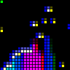 | **Speed**: Bar speed  **Intensity**: Ripple decay  **FFT Low**: Bands   
| 140 |  ♫ Waterfall |  | **Speed**   **Intensity**: Adjust color  **FFT High**: Select bin  **FFT Custom**:  Volume (minimum)   
| 141 |  ♫ Freqpixels |  | **Speed**: Fade rate  **Intensity**: Starting colour and # of pixels   
| 142 |  ♫ Binmap |  |  
| 145 |  ♫ Noisemove |  | **Speed**: Speed of perlin movement  **Intensity**: Fade rate   
| 155 |  ♫ Freqmap |  | **Speed**: Fade rate  **Intensity**: Starting color   
| 158 |  ♫ Gravfreq | 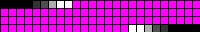 | **Speed**: Rate of fall  **Intensity**: Sensivity   
| 159 |  ♫ DJ Light |  | **Speed**: Speed   
| 160 |  ♫ 2D Funky Plank |  | **Speed**: Scroll speed  **FFT Low**: # of bands   
| 161 |  ♫ 2D CenterBars |  | **Speed**: Bar speed  **Intensity**: Ripple decay  **FFT Low**: # of bands   
| 163 |  ♫ Blurz |  | **Speed**: Fade rate  **Intensity**: Blur amount   
| 185 |  ♫ Rocktaves |  |  
| 186 |  ♫ 2D Akemi |  | **Speed**: Color speed  **Intensity**: Dance toggle   
#### Matrix Effects
| ID | Effect | Visual | Settings 
| ---: | --- | --- | --- 
| 146 | 2D Noise |  | **Speed**: Speed  **Intensity**: Scale   
| 149 | 2D FireNoise |  | **Speed**: X scale  **Intensity**: Y scale   
| 150 | 2D Squared Swirl |  | **FFT Custom**: Blur   
| 151 | 2D Fire2012 | 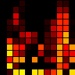 | **Speed**: Speed   
| 152 | 2D DNA |  | **Speed**: Scroll speed  **Intensity**: Blur   
| 153 | 2D Matrix | 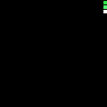 | **Speed**: Falling speed  **Intensity**: Spawning rate   
| 154 | 2D Metaballs |  |  
| 162 | 2D Pulser | 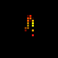 | **Speed**: Speed  **Intensity**: Blur   
| 164 | 2D Drift |  | **Speed**: Rotation speed  **Intensity**: Blur amount   
| 166 | 2D Sun Radiation | 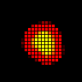 | **Speed**: Variance  **Intensity**: Brightness   
| 167 | 2D Colored Bursts |  | **Speed**: Speed  **Intensity**: Number of lines   
| 168 | 2D Julia |  | **Intensity**: Max iterations per pixel  **FFT Low**: X center  **FFT High**: Y center  **FFT Custom**: Area size   
| 172 | 2D Game Of Life |  | **Speed**   **Intensity**: Palette toggle   
| 173 | 2D Tartan | 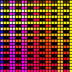 | **Speed**: X scale  **Intensity**: Y scale   
| 174 | 2D Polar Lights |  | **Speed**: Speed  **Intensity**: X scale  **FFT Low**: Palette   
| 176 | 2D Lissajous |  | **Speed**: X frequency  **Intensity**: Fadetime   
| 177 | 2D Frizzles |  | **Speed**: X frequency  **Intensity**: Y frequency   
| 178 | 2D Plasma Ball | 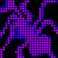 | **Speed**: Speed   
| 180 | 2D Hiphotic | 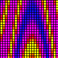 | **Speed**: X scale  **Intensity**: Y scale   
| 181 | 2D Sindots | 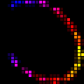 | **Speed**: Speed  **Intensity**: Dot distance   
| 182 | 2D DNA Spiral |  | **Speed**: Speed  **Intensity**: Frequency   
| 183 | 2D Black Hole |  | **Speed**: Outer X frequency  **Intensity**: Inner X frequency  **FFT Low**: Inner Y frequency   
#### Misc SR Effects
| ID | Effect | Visual | Settings 
| ---: | --- | --- | --- 
| 147 | Perlin Move |  | **Speed**   **Intensity**: # of pixels  **FFT Low**: fade rate   
| 179 | Flow Stripe | 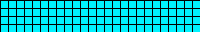 | **Speed**: Hue speed  **Intensity**: Effect speed   
| 184 | Wavesins |  | **Speed**: Speed  **Intensity**: Brightness variation  **FFT Low**: Starting Color  **FFT High**: Range of Colors  **FFT Custom**: Color variation   
