### Palettes
Palettes are rendered with the Palette effect
| ID | Palette | New Vis | Old Vis 
| ---: | --- | --- | ---
| 0 | Default |  | 
| 1 | * Random Cycle | 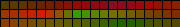 | 
| 2 | * Color 1 |  | 
| 3 | * Colors 1&2 | 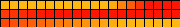 | 
| 4 | * Color Gradient | 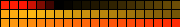 | 
| 5 | * Colors Only |  | 
| 6 | Party |  | 
| 7 | Cloud |  | 
| 8 | Lava | 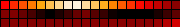 | 
| 9 | Ocean |  | 
| 10 | Forest | 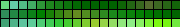 | 
| 11 | Rainbow |  | 
| 12 | Rainbow Bands |  | 
| 13 | Sunset | 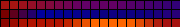 | 
| 14 | Rivendell |  | 
| 15 | Breeze |  | 
| 16 | Red & Blue | 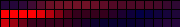 | 
| 17 | Yellowout |  | 
| 18 | Analogous |  | 
| 19 | Splash | 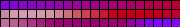 | 
| 20 | Pastel |  | 
| 21 | Sunset 2 |  | 
| 22 | Beech |  | 
| 23 | Vintage |  | 
| 24 | Departure |  | 
| 25 | Landscape |  | 
| 26 | Beach |  | 
| 27 | Sherbet |  | 
| 28 | Hult | 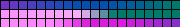 | 
| 29 | Hult 64 | 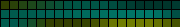 | 
| 30 | Drywet |  | 
| 31 | Jul |  | 
| 32 | Grintage | 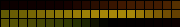 | 
| 33 | Rewhi | 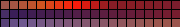 | 
| 34 | Tertiary |  | 
| 35 | Fire | 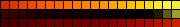 | 
| 36 | Icefire |  | 
| 37 | Cyane |  | 
| 38 | Light Pink |  | 
| 39 | Autumn | 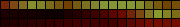 | 
| 40 | Magenta | 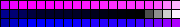 | 
| 41 | Magred | 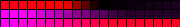 | 
| 42 | Yelmag |  | 
| 43 | Yelblu |  | 
| 44 | Orange & Teal |  | 
| 45 | Tiamat |  | 
| 46 | April Night |  | 
| 47 | Orangery | 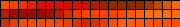 | 
| 48 | C9 |  | 
| 49 | Sakura |  | 
| 50 | Aurora | 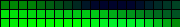 | 
| 51 | Atlantica |  | 
| 52 | C9 2 |  | 
| 53 | C9 New | 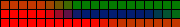 | 
| 54 | Temperature |  | 
| 55 | Aurora 2 |  | 
| 56 | Retro Clown |  | 
| 57 | Candy | 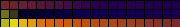 | 
| 58 | Toxy Reaf |  | 
| 59 | Fairy Reaf |  | 
| 60 | Semi Blue |  | 
| 61 | Pink Candy | 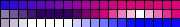 | 
| 62 | Red Reaf |  | 
| 63 | Aqua Flash |  | 
| 64 | Yelblu Hot |  | 
| 65 | Lite Light |  | 
| 66 | Red Flash | 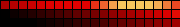 | 
| 67 | Blink Red |  | 
| 68 | Red Shift |  | 
| 69 | Red Tide | 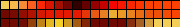 | 
| 70 | Candy2 |  | 
