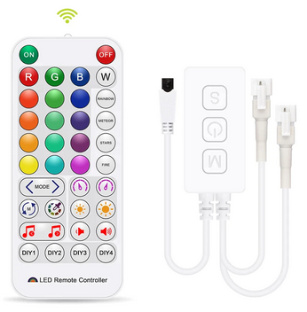
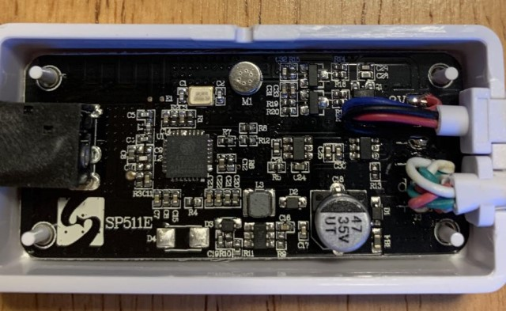
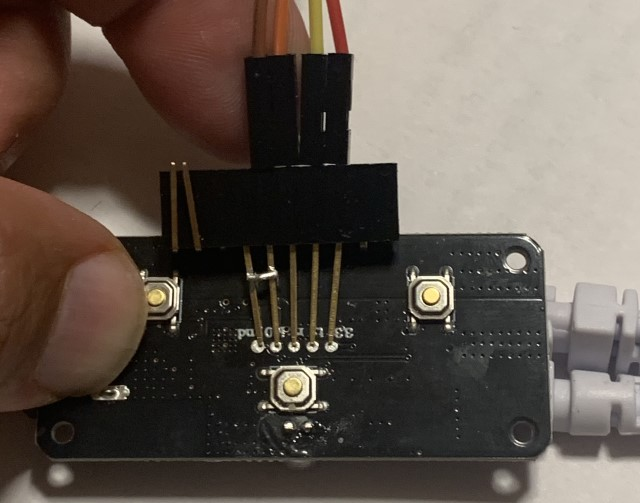
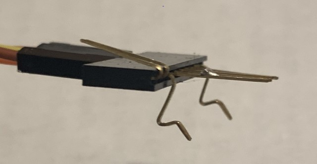

## Installing WLED on SP511E Controller

The SP511E addressable LED controller is the successor to the very popular SP501E controller. It is available for around $8 
on [AliExpress](https://www.aliexpress.com/item/1005002944086008.html?) and $12 on [Amazon](https://www.amazon.com/WS2811-WS2812-Controller-Bluetooth-DC5-24V/dp/B09CGNWDWF/). 
Like the SP501E, the SP511E is powered by an ESP8285 with 2MB flash running a firmware for the FairyNest app. 
Unlike the SP501E, the SP511E comes with an IR receiver and 38 key remote, 3 case push buttons, two output connectors (on same pin), 
and a microphone. Both the SP501E and SP511E controllers are quite capable, however FairyNest leaves much to be desired. 
It has 180 dynamic effects, however they are mostly different color combinations of perhaps a dozen animations. 
And before you can use the app, you have to register with your email.  

#### Firmware
To make better use of these controllers, we will be replacing the stock firmware with [WLED](https://github.com/Aircoookie/WLED).
WLED is open source and features over 100 animations and 70 color palettes, a large number of interfaces and is very configurable.
There is also a Sound Reactive fork of WLED. Because the FFT calculations require the additional processing power of the ESP32, the Sound Reactive
WLED community focuses their efforts there. The EPS8266 version does not have 2D matrix support or FFT effects, but it does have
over a dozen (volumetric) sound reactive animations in addition to all the effects in standard WLED. 
The last Sound Reactive WLED version that supported ESP8266 chips was 0.13.0b-3.
Since then, many of the features of the Sound Reactive fork have made their way to WLED 0.14. The WLED 0.14 version adds 2D support, numerous 2D effects and sound reactive effects (The effects will play but will use simulated noise instead of your microphone.)
The main SR developers have committed to getting volumetric effects working on ESP8266s again. But for now, you have to choose between having a working microphone and having the latest version.
- [WLED 0.13.3](https://github.com/scottrbailey/WLED-Utils/raw/gh-pages/firmware/WLED_0.13.3_sp511e.bin) 
- [SoundReactive 0.13.0b-3](https://github.com/scottrbailey/WLED-Utils/raw/gh-pages/firmware/soundReactive_0.13.0-b3_sp511e.bin). 
- [WLED 0.14.0b-2](https://github.com/srg74/WLED-wemos-shield/raw/master/resources/Firmware/%40Aircoookie/v0.14.0-b2/WLED_0.14.0-b2_SP511E_2m.bin)
- Check if there is a more recent firmware on [Serg's repository](https://github.com/srg74/WLED-wemos-shield/tree/master/resources/Firmware/%40Aircoookie)

#### Setup
Getting set up for the first time can take some time.  But once you have flashed to WLED the first time, you will be able
to perform over the air (OTA) updates.  Here is what you will need:
- USB to TTL UART adapter. I'm using the CP2102 available from [Amazon](https://www.amazon.com/HiLetgo-CP2102-Converter-Adapter-Downloader/dp/B00LODGRV8/) or [AliExpress](https://www.aliexpress.com/item/4000516394932.htm).
- Install the CP2102 [drivers](https://www.silabs.com/developers/usb-to-uart-bridge-vcp-drivers).
- A program to write to the ESP8266. Review the guide on [installing the WLED binary](https://kno.wled.ge/basics/install-binary/). I will be using [esptool](https://github.com/espressif/esptool) in this guide but ESP Home Flasher will work also.
- A clip to attach the CP2102 to the UART pads on the bottom of the board, and Dupont wires to attach the clip to the CP2102 adapter. You can purchase [pogo pin clips](https://www.aliexpress.com/item/1005001409579446.html) designed for this (2.0mm single row 5 pin). We will be making our own later in this guide.

#### Building a Clip
If you plan on flashing many of these controllers, I highly recommend purchasing the pogo pin clip. 
But if you are flashing one or two, it doesn't make sense to pay $11 for a clip to program an $8 controller. 
I used the long pinned male-female header. The long pins are springy enough to maintain good contact while you program the board.
If you have any Wemos D1 mini boards, you likely have plenty of these lying around. You can purchase them [here](https://www.aliexpress.com/item/1005003183490511.html).
The pins have a 2.54mm spacing and the pads are spaced 2.0mm so you will need to bend the pins in a bit. 
If you have a jumper lying around, put it on pins 4 and 5 before bending. Otherwise, solder a piece of wire between pins 4 and 5 after bending. 
I also bent two outer pins down, so they clip on the edge of the board. This isn't required, but it allows you to hold the 
clip firmly in place with one finger. If your header has additional pins, you can cut them off or bend them out of the way. 
If you don't have a clip and don't want to make one, you can also solder wires to the pads and desolder them once you are done. 
If you do this, __do not solder a Dupont pin on to the pad__. Cut and strip the wire and solder the wire to the pad. 
The rigid pins can rip the pads off of the PCB and you will be stuck with whatever firmware is on the board.  

#### Connecting
The pads on board are clearly labelled. When connecting the CP2102 to the clip, connect 3v3 to 3v3 and ground to ground,
but cross TX to RX and RX to TX. You also need to connect io0 to ground in order to program it. There is only 1 ground pin on the
CP2102, which is why we connected pins 4 and 5 together with a jumper or wire. The CP2102 also has a 5v pin, be sure to use 3v3 and not 5v!
 
#### Programming
Now we are ready to program the board. If esptool detects multiple ports, it can take a while as it attempts to write to each port. 
We'll start by figuring out what port our CP2102 is on. Plug the CP2102 in to your USB port then
open Device Manager. Expand the "Ports (COM & LPT)" section and note the port for the Silicone Labs CP210x device.
Mine happens to be COM4. Now open a Power Shell or CMD window and change directory to where you downloaded the WLED firmware 
to and type in the following command.  Be sure to replace COM4 with whatever your port is and the correct name for your firmware.  

`esptool.py -p COM4 write_flash 0x0 WLED_0.13.3_sp511e.bin`  

If you have the pogo clip, and the SP511E is attached, you can hit enter right away. But if you are using the long-pin 
headers that need held in place, type the command but do not hit enter. Unplug the CP2102 from your USB port, position the clip
over the pads, and plug the CP2102 back in. Hit Enter to execute the command you typed earlier. It will take about 60 seconds
to write to flash. Once it completes and verifies, you will see a success message. You can disconnect the CP2102.

#### Configuring
Connect the controller to a 5-24v power supply and verify you see the WLED-AP WiFi access point. If you see it, the firmware upload succeeded.
You can stuff it back in its enclosure and follow the [getting-started guide](https://kno.wled.ge/basics/getting-started/) 
to get it connected to your network and configured. 

Once your basic setup is complete, go back to the "LED Preferences" page.
- The LED GPIO will already be set (pin 3). Due to the pin the manufacturers chose, you will get memory warnings above 250 LEDs. 
- The IR pin is 5, but should already be set for you.  onfigure IR by selecting "JSON remote" as the remote type. Once you select "JSON remote" a control will appear to upload the config.  Upload the 38-key config found [here](https://kno.wled.ge/interfaces/json-ir/json_infrared/).
- Configure the two additional buttons. The power button (pin 2) is set as button 0 because its default behavior is to toggle off and on. Set button 1 to pin 13 ("M" button) and button 2 to 14 ("S" button).

#### Create "Macro" Presets
- You will need to make four presets to handle the short and long presses for the two remaining buttons. 
- Go to the "Presets" tab and click the button to add a new preset. Uncheck the "Use current state" checkbox to get the API command text box.
- We will make the "M" button cycle through effects with the API Command of `FX=~` saved to ID 100. To cycle in reverse, make a second preset with `FX=~-` and save to 101. 
- We will make the "S" button to increase or decrease effect speed. The API commands would be `SX=~16` and `SX=~-16`. Save to ids 102 and 103.
- Finally, you need to map your presets to the button action. Go to Config -> "Time & Macros" and set short press on button 1 to 100 and long press to 101. For button 2, set short press to 102 and long press to 103.
- You can control almost aspect of WLED with API commands. Check out the documentation for [HTTP](https://kno.wled.ge/interfaces/http-api/) or [JSON](https://kno.wled.ge/interfaces/json-api/) API commands.
